# 📊 LuboBali.com: Real-Time Portfolio Analytics Pipeline

> **A full-stack analytics solution for tracking and analyzing portfolio website engagement**

[](https://python.org)
[](https://fastapi.tiangolo.com)
[](https://postgresql.org)
[](https://streamlit.io)
[](https://railway.app)

**Live Dashboard:** [View Analytics](https://lubo-portfolio-tracker-dxaegqj2g4uek6webyjob8.streamlit.app)  
**Portfolio Website:** [lubobali.com](https://lubobali.com)

---

## 🎯 Why I Built This

As a data engineer, I wanted to understand how visitors interact with my portfolio website beyond basic Google Analytics. This project demonstrates my ability to:

- **Build end-to-end data pipelines** from collection to visualization
- **Design scalable ETL processes** with automated batch processing
- **Create production-ready APIs** with proper error handling and monitoring
- **Implement real-time dashboards** with interactive data visualizations
- **Deploy cloud infrastructure** using modern DevOps practices

This analytics pipeline gives me **actionable insights** about which projects resonate most with employers and the tech community, helping me optimize my portfolio for maximum impact.

---

## 🏗️ Architecture Overview

```mermaid
graph LR
    A[👤 Website Visitor] --> B[🌐 lubobali.com]
    B --> C[📊 tracker.js]
    C --> D[🚀 FastAPI Backend]
    D --> E[🗄️ PostgreSQL Database]
    E --> F[⏰ Daily Cron Job]
    F --> G[📈 Streamlit Dashboard]
    G --> H[💼 LinkedIn Insights]
```



### Tech Stack
- **Frontend Tracking:** Vanilla JavaScript (embedded in Framer)
- **Backend API:** FastAPI with CORS support
- **Database:** PostgreSQL on Railway
- **ETL Pipeline:** Python with automated cron scheduling
- **Dashboard:** Streamlit Cloud with Plotly visualizations
- **Infrastructure:** Railway (API + Database + Cron Jobs)

---

## 🔧 Key Features

### Real-Time Data Collection
- **Session tracking** with unique visitor identification
- **Time-on-page measurement** with accurate engagement metrics
- **Traffic source analysis** (LinkedIn, Google, direct traffic)
- **Device detection** (mobile vs desktop)
- **Page-level analytics** for individual project performance

### Automated Data Processing
- **Daily aggregation** runs automatically at midnight UTC
- **ETL pipeline** processes raw clicks into summarized insights
- **Data quality checks** and error handling
- **Historical trend analysis** with time-series data

### Interactive Dashboard
- **Real-time visualizations** with Plotly charts
- **Traffic source breakdown** with referrer analysis
- **Device usage patterns** and engagement metrics
- **Top-performing projects** ranked by visitor engagement
- **Date filtering** and interactive exploration

### Production-Ready Infrastructure
- **Automated deployments** with Railway
- **Environment-based configuration** for dev/prod
- **Database connection pooling** and optimization
- **Error logging** and monitoring
- **CORS security** and API rate limiting

---

## 📁 Project Structure

```
lubo-portfolio-tracker/
├── 📊 Analytics Core
│   ├── app.py                    # FastAPI backend server
│   ├── daily_aggregator.py       # ETL pipeline logic
│   └── cron_daily_aggregator.py  # Automated job runner
│
├── 🎨 Dashboard & Visualization
│   ├── dashboard.py              # Streamlit analytics dashboard
│   └── .streamlit/config.toml    # Dashboard configuration
│
├── 🔧 Utilities & Scripts
│   ├── step8_analysis_insights.py # LinkedIn insight generator
│   ├── detailed_insights.py      # Deep-dive analytics
│   └── clean_database.py         # Database reset utility
│
├── 🚀 Infrastructure
│   ├── requirements.txt          # Python dependencies
│   ├── railway.toml              # Railway deployment config
│   ├── runtime.txt               # Python version specification
│   └── schema.sql                # Database schema definition
│
└── 📋 Documentation
    ├── Full_Step_by_Step_Plan.md # Complete implementation guide
    └── README.md                 # This file
```

---

## 🚀 How It Works

### 1. **Data Collection**
When someone visits [lubobali.com](https://lubobali.com), a lightweight JavaScript tracker automatically:
- Generates a unique session ID
- Tracks time spent on each page
- Captures referrer information
- Detects device type and browser
- Sends data to FastAPI backend via POST requests

### 2. **Data Storage**
The FastAPI backend receives tracking data and:
- Validates incoming requests with Pydantic models
- Stores raw clicks in `click_logs` table
- Handles CORS for cross-origin requests
- Provides health checks and monitoring endpoints

### 3. **Data Processing**
A daily cron job automatically:
- Aggregates previous day's click data
- Calculates engagement metrics and trends
- Groups data by project, referrer, and device
- Stores summaries in `daily_click_summary` table

### 4. **Data Visualization**
The Streamlit dashboard provides:
- Real-time charts showing visitor patterns
- Interactive filters for date ranges and metrics
- Top-performing project rankings
- Traffic source analysis and insights

---

## 💡 Business Impact

This analytics system helps me:

- **Optimize portfolio content** based on visitor engagement data
- **Track referral effectiveness** from LinkedIn, GitHub, and job applications
- **Identify high-performing projects** that resonate with employers
- **Generate data-driven LinkedIn posts** showcasing portfolio performance
- **Make informed decisions** about which projects to highlight

### Sample Insights Generated:
> *"📊 Portfolio analytics insight: My visitors spend an average of 104 seconds browsing my projects! 34% of people stay longer than 1 minute."*

> *"💡 76% of my portfolio traffic is direct/bookmarked visits. Building a memorable brand pays off!"*

---

## 🛠️ Technical Implementation

### Database Schema
```sql
-- Raw click tracking
CREATE TABLE click_logs (
    id SERIAL PRIMARY KEY,
    timestamp TIMESTAMP DEFAULT NOW(),
    page_name TEXT,
    tag TEXT,
    user_agent TEXT,
    referrer TEXT,
    session_id TEXT,
    time_on_page INTEGER,
    ip_hash TEXT
);

-- Daily aggregated summaries
CREATE TABLE daily_click_summary (
    date DATE,
    project_name TEXT,
    total_clicks INTEGER,
    avg_time_on_page FLOAT,
    device_split JSON,
    top_referrers JSON,
    repeat_visits INTEGER,
    tag TEXT
);
```

### API Endpoints
- `POST /api/track-click` - Receive visitor tracking data
- `GET /health` - Service health check
- `GET /` - API documentation and status

### Deployment Configuration
- **Railway Services:** Web server + PostgreSQL + Cron jobs
- **Environment Variables:** Database connections and API keys
- **Automated Scaling:** Handles traffic spikes automatically

---

## 📈 Results & Performance

- **⚡ Sub-100ms API response times** for tracking requests
- **📊 99.9% uptime** with Railway cloud infrastructure  
- **🔄 Automated daily processing** without manual intervention
- **📱 Mobile-responsive dashboard** for analytics on any device
- **🚀 Real-time insights** available within minutes of visitor activity

---

## 🚨 Important Disclaimer

**This project is for demonstration and educational purposes only.**

- **Portfolio showcase:** Demonstrates my technical skills and knowledge
- **Learning resource:** Feel free to explore the code for ideas and inspiration
- **Not production-ready for external use:** Built specifically for my personal portfolio needs
- **No warranty or support:** Use at your own risk if adapting for other purposes

If you're interested in building something similar, I recommend:
- Understanding the privacy implications of user tracking
- Implementing proper data protection measures
- Complying with GDPR, CCPA, and other privacy regulations
- Using established analytics platforms for production websites

---

## 🤝 Connect With Me

**Lubo Bali** - Data Engineer  
📧 [Contact](https://lubobali.com/contact)  
💼 [LinkedIn](https://linkedin.com/in/lubobali)  
🌐 [Portfolio](https://lubobali.com)

---

*Built with ❤️ as a demonstration of full-stack data engineering capabilities*
